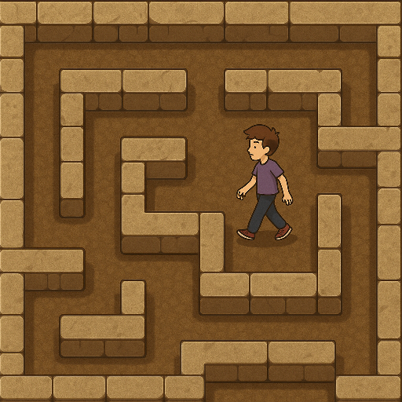
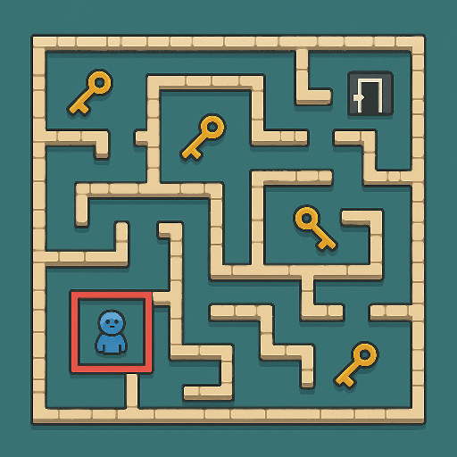

# 🌀 MazeMates 
**"אחד רואה, השני עושה אבל מנצחים רק ביחד!"**

---

## מהות המשחק

הוא משחק מחשב שיתופי לשניים או שלושה שחקנים היושבים יחד באותו חלל.  
המטרה היא לעבור מבוך מאתגר תוך שימוש בתקשורת, שיתוף פעולה, ותיאום פעולות בזמן אמת.  
המשחק נועד לפתח מיומנויות חברתיות בקרב בני נוער על הרצף האוטיסטי בתפקוד גבוה, תוך חיזוק יכולת הקשבה, תכנון, וויסות וקבלת החלטות משותפת.

המשחק מיועד למחשב אישי (PC), ללא צורך בחיבור לאינטרנט.  
השחקנים יושבים זה לצד זה מול 2 או 3 מחשבים\טאבלטים, וכל אחד מהם ממלא תפקיד ייחודי ופעיל.

*תמונה לדמיון:*  
  - מסך 1 – מציג מבט על (של הנווט),
  - מסך 2 מציג מבט בגוף ראשון (של המנווט)
  - מסך 3 (כאשר יש 3 שחקנים) לוח שליטה קטן למתפעל.

---

## רכיבים רשמיים

### 1. שחקנים

- **קהל יעד:** בני נוער על הספקטרום האוטיסטי בתפקוד גבוה (גילי 12–18).  
- **מספר שחקנים:** 2 או 3 שחקנים באותו חלל.  
- **אינטראקציה:** שיתופית בלבד – כולם מנצחים או מפסידים יחד.  

#### תפקידי השחקנים:
- 🧭 **המטייל (Explorer):**  
  רואה רק את סביבתו הקרובה במבוך, שולט בתנועת הדמות. 
  עליו להקשיב היטב להוראות המדריך ולנוע בדיוק לפי ההכוונה.
  

- 🗺️ **הנווט (Navigator):**  
  רואה את מפת המבוך המלאה מלמעלה, אך לא יכול לזוז.  
  תפקידו להכווין את המטייל, לסובב את הלוח בעת שהדרך חסומה למטייל, ולתקשר בבירור ובשלווה. 

- 🔧 **המתפעל (Operator)** *(נוסף כשיש 3 שחקנים)*:  
  רואה מסך עם מנגנונים טכניים של המבוך – כפתורים, דלתות, שערים ומכשולים.  
  עליו להפעיל אותם ברגע הנכון באם מבקשים ממנו הנווט או המטייל.

---

### 2. יעדים

- להגיע יחד לשער היציאה של המבוך תוך איסוף מפתחות וחפצים.  
- לסיים את המבוך לפני שהשעון נגמר.  
- לשמור על תקשורת שוטפת – כל חוסר תיאום יאט את ההתקדמות.

המשחק מודיע על היעדים בצורה גרפית (סמל יעד, טיימר, רמזים ויזואליים ומילוליים).  

---

### 3. תהליכים

#### תחילת המשחק (30 שניות ראשונות)
- השחקנים בוחרים את מספר המשתתפים (2 או 3) ואת תפקידיהם.  
- מופיעה הדגמה אינטראקטיבית קצרה שמלמדת כיצד לשתף פעולה.  
- מתקיים שלב "חימום" – למשל: המדריך אומר למנווט להביא "כוכב" ראשון, והמתפעל צריך לפתוח את הדלת הנכונה.

#### תהליך הליבה
3 מבוכים ושלב סיום, בכל מבוך:
- המדריך מתבונן במפה, מנחה בעל־פה, ומסובב את המפה בעת הצורך.  
- המנווט מבצע תנועות על פי ההוראות, ואוסף מפתחות.  
- המתפעל מפעיל כפתורים, מנופים או מנגנונים טכניים על פי הצורך.  
- כל מבוך כולל מצבי "תקשורת חובה" שבהם אף אחד לא יכול להתקדם בלי עזרת האחרים.  
- לדוגמה: דלת נפתחת רק אם המנווט עומד על סימן מסוים והמתפעל לוחץ בזמן על כפתור.

#### תהליך הסיום
- כשהמטייל מגיע לשער היציאה, הם נדרשים לשלב כוחות ב"חידת סיום" –  
  חידה המורכבת מחפצים שאספו במהלך הדרך, ועליהם לפתור אותה על מנת לנצח במשחק.

#### למידת המשחק
- הדרכה ויזואלית וקולית בתחילת המשחק, כולל משחק חימום ואופציה להסבר ויזואלי וקולי על שלב במהלכו.  
- משוב חיובי ("איזו תקשורת מעולה!") מחזק התנהגות רצויה.

---

### 4. חוקים

- כל שחקן אחראי רק על פעולות תפקידו.  
- אין אפשרות לעבור תפקיד באמצע שלב/מבוך.  
- אין אפשרות להתקדם ללא שיתוף פעולה.
- אי אפשר לסיים שלב/מבוך בלי לאסוף את כל המפתחות והחפצים בדרך.  
- טעויות חוזרות יגררו הצגת רמזים, ושינוי הקושי בצורה אוטומטית(לדוגמא, איסוף אוטומטי של מפתחות/חפצים). 
- החוקים מוצגים בתחילת כל שלב בשפה פשוטה וברורה.

---

### 5. משאבים

- **זמן:** יש לסיים כל שלב לפני שהטיימר נגמר.  
- **מפתחות:** פותחים דלתות חדשות. 
- **חפצים:** נחוצים בשביל החידה בשלב האחרון של המשחק. 
- **רמזים:** מספר מוגבל של רמזים לחידות הסיום.   
- המשאבים יופיעו על המסך בצבעים מנחים עם צלילים ברורים להבנה.

---

### 6. עימותים

- **נגד המערכת:** מכשולים, חידות וזמן.  
- **בין שחקנים:** חוסר תיאום, הוראות לא ברורות.  
- **פנימי:** קושי בוויסות רגשי תחת לחץ או טעויות.  

העיצוב מעודד תרגול של סבלנות, תקשורת רגועה ופתרון בעיות משותף.

---

### 7. גבולות

- עולם המשחק סגור – מבוך משתנה בכל שלב, עם גבולות חזותיים ברורים.    
- הצבעים שקטים ונעימים לעין, והצלילים עדינים למניעת עומס חושי.  
- הגבולות מוצגים בקו עדין וברור, כך שהשחקנים יודעים היכן אפשר ואי אפשר לנוע.

---

### 8. תוצאות

- **ניצחון:** המטייל מגיע לשער ופותרים את החידה הסופית.  
- **כישלון:** הזמן נגמר. 
- התוצאה מבוססת כמעט לחלוטין על תקשורת ותיאום, לא על מזל.  
- המשחק שיתופי – כולם מנצחים או מפסידים יחד.

---

## סקירת משחקים קיימים

**ביטויי חיפוש:**  
“cooperative maze local game”, “team communication puzzle offline”, “autism teamwork pc game”.

**1. Keep Talking and Nobody Explodes**  
[קישור](https://keeptalkinggame.com/)  
שחקן אחד רואה פצצה, השני קורא הוראות.  
➡️ אצלנו המשחק מתרחש פנים אל פנים, עם תפקידים פעילים לשלושת המשתתפים.

**2. We Were Here**  
[קישור](https://store.steampowered.com/app/582500/We_Were_Here/)  
שני שחקנים משתפים מידע מילולי כדי לפתור חידות.  
➡️ אצלנו השליטה מבוזרת וכל שחקן משפיע על המשחק בזמן אמת.

**3. Overcooked**  
[קישור](https://store.steampowered.com/app/448510/Overcooked/)  
משחק בישול שיתופי.  
➡️ אצלנו אין לחץ זמן מהיר או כאוס, אלא תקשורת רגועה וממוקדת למטרות שיקומיות.

**ייחודיות המשחק:**  
השילוב בין שליטה מבוזרת, תפקידים מובחנים, ותקשורת ישירה בין 2–3 שחקנים יוצר סביבה מאוזנת ומעשירה ללמידת שיתוף פעולה אמיתי.  
הרכיב הבולט ביותר הוא **האינטראקציה החברתית הרב־תפקודית**, המעוצבת במיוחד לפיתוח תקשורת, אמון ועבודת צוות בקרב בני נוער על הרצף.

